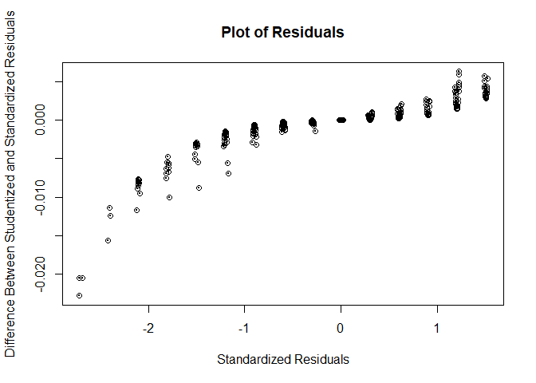

<!-- README.md is generated from README.Rmd. Please edit that file -->

## Overview

The goal of hw3forBios625 is to develop an R package implementing an
existing R function.

# linearRegression

<!-- badges: start -->

[](https://github.com/haoyi1102/hw3forBios625/actions/workflows/R-CMD-check.yaml)
[](https://app.codecov.io/gh/haoyi1102/hw3forBios625?branch=master)
<!-- badges: end -->

The goal of linearRegression is to performing linear regression
analysis. This package allows users to easily compute linear regression
coefficients, residuals, standard errors, t-values, p-values, multiple
R-squared, F-statistic, and p-value for the F-statistic for any given
dataset.

## Installation

You can install the development version of linearRegression from
[GitHub](https://github.com/) with:

``` r
#install.packages("devtools") --> 
devtools::install_github("haoyi1102/hw3forBios625")
#> Skipping install of 'linearRegression' from a github remote, the SHA1 (cca36745) has not changed since last install.
#>   Use `force = TRUE` to force installation
```

## dataset

``` r
# Load the package
library(linearRegression)

#load example dataset
data("testdata")
names(data)
#>  [1] "Afib"          "Age"           "ALS"           "Alz"          
#>  [5] "Cad"           "Cancer"        "Chf"           "Comorbidity1" 
#>  [9] "Copd"          "CurrentSmoker" "Db"            "Dementia"     
#> [13] "Depression"    "Education"     "Epilepsy"      "Esrd"         
#> [17] "Etoh"          "Fatalism"      "HiChol"        "Hospit"       
#> [21] "Htn"           "HxStroke"      "ICH"           "ID"           
#> [25] "Insur"         "Ischemic"      "Mastery"       "MI"           
#> [29] "NIHScore"      "Optimism"      "Parkinson"     "Participant"  
#> [33] "Pessimism"     "PtProxy"       "R_E"           "SAH"          
#> [37] "Sex"           "Spirituality"  "StrokeType"    "TIA"          
#> [41] "missnumber"    "incomplete"    "Age_less_eq54" "Age_55to64"   
#> [45] "Age_65to74"    "Age_ge75"      "Age_4Cat"      "NIHSS_0_1"    
#> [49] "NIHSS_2_3"     "NIHSS_4_7"     "NIHSS_g7"      "NIHSS_4Cat"   
#> [53] "EducationHS"
```

Check out the help page for the `data` data set using `?data`

## Usage

After installation, load the package and use the ‘linearRegression’
function as follows:

``` r
library(linearRegression)

# Basic usage
#result <- linearRegression(outcome_name = "OutcomeVariable", 
#                           predictor_name = "PredictorVariable", 
#                           data = YourDataFrame, 
#                           plot = TRUE)
```

## Example

This is a basic example which shows you how to solve a common problem:

``` r
# Load the package
library(linearRegression)

#Perform linear regression
result <- linearRegression("Optimism", "Age", data = data , plot = TRUE)
```



``` r

#view the results
print(result)
#> $Residuals
#> [1] -9.04817544 -2.03585552  0.03344406  2.97030444  5.06578386
#> 
#> $Coefficients
#>       Estimate Std.Error    t_value           Pr
#>   19.189854582 0.7472950 25.6790878 3.776605e-99
#> x -0.003079981 0.0111571 -0.2760558 7.825987e-01
#> 
#> $`Multiple R-squared`
#> [1] 0.0001249136
#> 
#> $`F-statistic`
#> [1] 0.07620679
#> 
#> $`p-value`
#> [1] 0.7825987
```

## Test correctness and efficiency

The comparison(s) against the original R function(s) on simulated or
real datasets clearly and sufficiently demonstrate both correctness and
efficiency of the function(s) implemented in the R package.

``` r
library(linearRegression)

# Load test data
data("testdata")

# Run the custom linear regression function
m <- linearRegression("Optimism", "Age", data)

# Run the built-in lm() function and summarize it
m1 <- summary(lm(Optimism ~ Age, data))
```

Test correctness

``` r
library(testthat)

test_that("linearRegression matches lm function results", {
  
  # Compare Residuals
 
  expect_equal(m$Residuals, as.vector(fivenum(m1$residuals)))

  # Compare Coefficients
  # Extract coefficients from the custom model
  custom_coeffs <- m$Coefficients$Estimate

  # Extract coefficients from the lm model summary
  lm_coeffs <- m1$coefficients[, "Estimate"]

  # Expect the coefficients from the custom model to match those from the lm model
  expect_equal(custom_coeffs, as.vector(lm_coeffs))

  # Compare Multiple R-squared
  # Expect the Multiple R-squared from the custom model to match that from the lm model
  expect_equal(m$`Multiple R-squared`, m1$r.squared)

  # Compare F-statistic
  # Expect the F-statistic from the custom model to match that from the lm model
  expect_equal(m$`F-statistic`, as.vector(m1$fstatistic[1]))

  # Compare p-value of F-statistic
  # Calculate p-value for F-statistic from the lm model
  p_value_f_lm <-
    pf(m1$fstatistic[1], m1$fstatistic[2], m1$fstatistic[3], lower.tail = FALSE)

  # Expect the p-value from the custom model to match the calculated p-value from the lm model.
  expect_equal(m$`p-value`, as.vector(p_value_f_lm))

})
#> Test passed
```

Test efficiency

``` r

# bench::mark for estimate
bench::mark(
  m$Coefficients$Estimate, 
  as.vector(m1$coefficients[, "Estimate"]),
  iterations = 10,
  check = TRUE
)
#> # A tibble: 2 × 6
#>   expression                             min median `itr/sec` mem_alloc `gc/sec`
#>   <bch:expr>                           <bch> <bch:>     <dbl> <bch:byt>    <dbl>
#> 1 "m$Coefficients$Estimate"            1.7µs 2.05µs   294985.        0B        0
#> 2 "as.vector(m1$coefficients[, \"Esti… 3.9µs  4.5µs   160256.        0B        0

# bench::mark for F- statistic
bench::mark(
  m$`F-statistic`, 
  as.vector(m1$fstatistic[1]),
  iterations = 10,
  check = TRUE
)
#> # A tibble: 2 × 6
#>   expression                       min   median `itr/sec` mem_alloc `gc/sec`
#>   <bch:expr>                  <bch:tm> <bch:tm>     <dbl> <bch:byt>    <dbl>
#> 1 m$`F-statistic`                500ns    1.1µs   699301.        0B        0
#> 2 as.vector(m1$fstatistic[1])    3.1µs    3.4µs   220751.        0B        0

# bench::mark for p-value

p_value_f_lm <-
    pf(m1$fstatistic[1], m1$fstatistic[2], m1$fstatistic[3], lower.tail = FALSE)

bench::mark(
  m$`p-value`, 
  as.vector(p_value_f_lm),
  iterations = 10,
  check = TRUE
)
#> # A tibble: 2 × 6
#>   expression                   min   median `itr/sec` mem_alloc `gc/sec`
#>   <bch:expr>              <bch:tm> <bch:tm>     <dbl> <bch:byt>    <dbl>
#> 1 m$`p-value`                  1µs    1.2µs   704225.        0B        0
#> 2 as.vector(p_value_f_lm)    1.2µs    1.4µs   444444.        0B        0
```

## Getting Help

If you encounter any issues or have questions about the
‘linearRegression’ package:

1.  Refer to the in-built documentation by calling ‘?linearRegression’
    in R.

2.  Check the vignettes for detailed examples and use cases.
